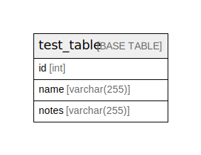

# test

## Tables

| Name | Columns | Comment | Type |
| ---- | ------- | ------- | ---- |
| [test_table](test_table.md) | 2 |  | BASE TABLE |

## Relations

---

> Generated by [tbls](https://github.com/k1LoW/tbls)
